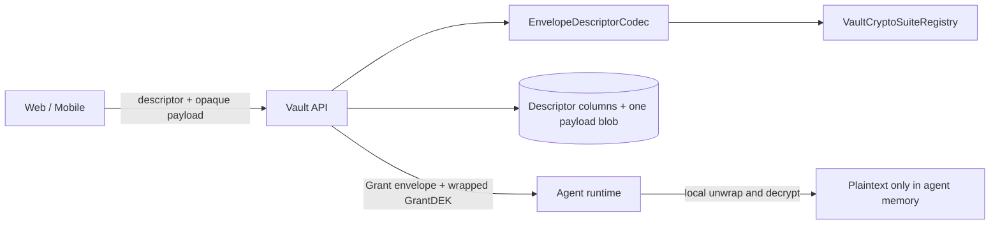

# Vault protocol 2 canonical wire contract

The backend accepts one non-negotiated Vault profile: `palladin-vault-xchacha-v1`.
Encrypted values cross the API as `{ descriptor, encodedSuitePayload }`. The current opaque payload
layout is `nonce[24] || ciphertextAndTag`; only the selected suite understands that layout.

The descriptor is canonical AEAD AAD. It binds protocol version, suite ID, purpose, exact resource
scope, revision, key version, optional Member key generation, and the purpose-specific binding.

X25519 wrappers use `palladin-x25519-sealed-box-v1`. A wrapper is always a canonical descriptor
plus an exact 120-byte sealed package. It binds purpose, scope, revision, wrapped-key version,
optional generation, recipient key kind/version/fingerprint, and—when wrapping a Reason or Grant
DEK—the parent envelope descriptor hash.

Vault creation requires explicit public trust anchors; the backend cannot derive them from encrypted
private-key envelopes:

- Agent Message: `palladin-x25519-v1`, raw 32-byte public key, version equal to the initial Agent
  Message private envelope and key epoch.
- Manifest Signing: `palladin-ed25519-v1`, raw 32-byte public key, version equal to the initial
  Manifest Signing private envelope and key epoch.

Both use `VaultPublicKeyContract { protocolVersion, schemeId, keyKind, keyVersion,
encodedPublicKey, fingerprint }`. The backend recomputes the domain-separated fingerprint and
rejects mismatched scheme, key kind, version, length, or encoding. A fenced rotation reads current
anchors from `GET /api/vaults/{vaultId}/key-rotations/{rotationId}/source/public-keys`.

Credential delivery returns only identifiers, approved methods, and the canonical Grant envelope.
It never returns or resolves plaintext `Label` or `UrlDomain`; user-visible entry metadata remains
inside client-encrypted payloads.
